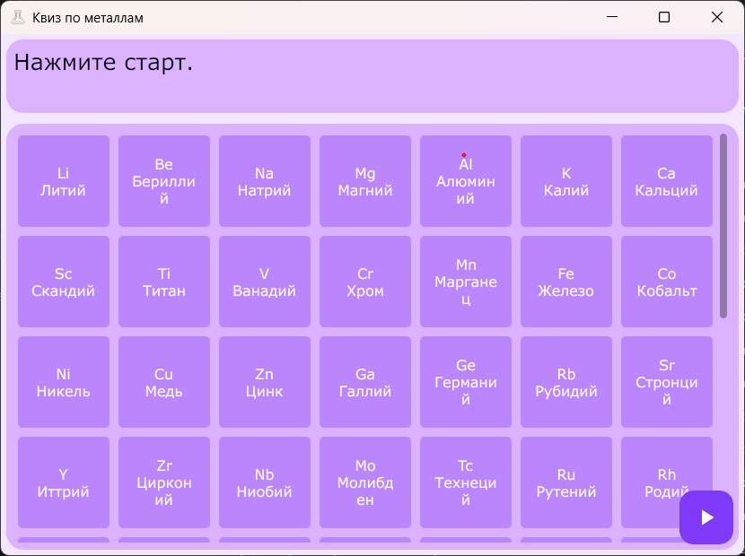

# Quiz 'bo' metals

Небольшая викторина на знание металлов, написанная на Go с интерфейсом на GioUI.

## Скриншот



## Установка

```bash
go install github.com/Alka-devel/quiz-metal@latest
```

Или собрать из исходников:

```bash
git clone git@github.com:Alka-devel/quiz-metal.git
cd quiz-metal
go build
```

## Требования

- Go 1.23+
- Windows (использует rsrc_windows_amd64.syso для иконки приложения)

## Лицензия

MIT — см. [LICENSE](LICENSE)